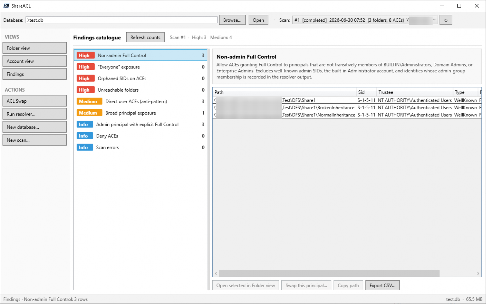

# ShareACL

ShareACL is a Windows PowerShell 7 tool for auditing NTFS permissions at scale. It captures folder ACLs in a portable SQLite database, resolves Active Directory identities and group membership, and provides focused views for investigation and controlled ACL substitutions.

**[Quick start](#quick-start)** · **[Features](#features)** · **[Operations guide](#operations-guide)** · **[Safety](#operational-safety)**

> ShareACL is an audit and change-support tool. Treat scan results as evidence, verify conclusions against the live filesystem where appropriate, and use normal change control for ACL changes.



## Features

| Capability | What it helps you do |
| --- | --- |
| 📁 **Folder view** | Filter and review up to 5,000 matching folders at a time, inspect each folder’s ACEs, identify broken inheritance and explicit permissions, and export the folder and trustee detail to CSV. |
| 👤 **Account view** | Find folders reachable by a user, group, or computer, show direct versus group-derived access, and optionally verify live effective access. |
| 📋 **Findings** | Prioritise common permission risks such as orphaned SIDs, broad access, direct user ACEs, Deny ACEs, and scan errors. |
| 🔎 **Collector and resolver** | Scan one or more roots to SQLite, then resolve SIDs and transitive group membership from Active Directory. Run them from the GUI or independently. |
| 🔃 **ACL Swap** | Preview, execute, audit, and verify a replacement of one explicit trustee with another. Supports scan-based discovery and a live filesystem walk. |
| 🧾 **Audit and diagnostics** | Record swap activity in SQLite and JSONL, and inspect bounded session errors from the clickable status-bar indicator. |

### A typical workflow

1. Scan one or more folder roots into a local SQLite database.
2. Run the resolver to replace raw SIDs with identities and record group membership.
3. Start in **Findings** to identify higher-risk patterns.
4. Use **Folder view** for folder-focused investigation and **Account view** for principal-focused investigation.
5. Export a focused CSV when a result needs review outside ShareACL.
6. Use **ACL Swap** only after previewing, approving, and narrowing the required change.

## Requirements

Run ShareACL from a Windows device that can reach the relevant file shares and, for identity resolution, Active Directory domain controllers.

| Requirement | Used for |
| --- | --- |
| PowerShell 7+ (Tested on 7.6.3) | GUI, collector, and resolver |
| [PSSQLite](https://www.powershellgallery.com/packages/PSSQLite) | ShareACL database access |
| [NTFSSecurity](https://www.powershellgallery.com/packages/NTFSSecurity) | Collecting and changing NTFS ACLs |
| ActiveDirectory module / RSAT | Resolving principals, group memberships, and live AD principal search |

Check the environment before first use:

```powershell
$PSVersionTable.PSVersion
Get-Module -ListAvailable ActiveDirectory, PSSQLite, NTFSSecurity
```

If permitted in your environment, install PowerShell Gallery modules for the current user:

```powershell
Install-Module PSSQLite -Scope CurrentUser
Install-Module NTFSSecurity -Scope CurrentUser
```

The account running a scan needs read access to the folders being audited. Access-denied and path errors do not stop the scan, but they are audit gaps and appear in **Findings** and the scan error records.

## Quick start

1. Clone or extract the repository on a workstation with the required access.
2. Start the isolated GUI launcher:

   ```powershell
   Set-ExecutionPolicy Bypass -Scope Process
   .\ShareAcl.GUI\Start-ShareAcl.ps1
   ```

   The launcher starts the GUI in its own PowerShell process, keeping each GUI session isolated from previous runs.

3. Select **New database…** and save a database, for example `C:\Temp\shareacl.db`.
4. Select **New scan…**, add one or more UNC or local roots, and start the scan.
5. Leave **Run resolver after** enabled unless identity resolution is being performed separately.
6. Choose the completed scan from the **Scan** list, then open **Findings**, **Folder view**, or **Account view**.

Use UNC paths where possible:

```text
\\fileserver01\Finance
\\fileserver01\HR
```

For a first validation, scan one small representative root. After confirming that the workstation, account, modules, and database location work as expected, expand the scope.

## Operations guide

### Create, open, and select scans

The top bar controls the active database and scan. Opening a database validates the ShareACL tables and applies supported additive migrations. The current scan determines the data available in the reporting views.

New scans report progress in two phases:

- **Counting** estimates folder count and completion time.
- **Running** records folders, ACLs, owners, inheritance state, and scan errors.

Use **Run resolver…** to resolve outstanding principals and group memberships for the current scan or the whole database without running another collection.

Folder, Account, and Findings queries load in the background; ShareACL shows a busy overlay while results are being retrieved.

### Folder view

Use **Folder view** to investigate a path or permission structure.

1. Enter part of a path and press <kbd>Enter</kbd>, or choose **Refresh**.
2. Optionally select **Broken inheritance only** or **Explicit ACEs only**.
3. Select a folder to inspect its trustee, SID, type, rights, inheritance, and source details.
4. Choose **Export CSV…** to export the current filtered set.

Folder CSV exports include the trustee/ACE detail needed for review:

- Scan roots list their recorded ACEs, including inherited ACEs.
- Inherited child folders include an **Inherited from parent** row, followed by any explicit ACE rows.
- Broken-inheritance folders include one row per ACE.
- Inheritance that originates above the scan root is labelled **Parent out of scope**.

### Account view

Use **Account view** to answer “what can this principal reach?”

1. Choose **Pick principal…**.
2. Search the resolved database identities or Active Directory. The search box receives focus automatically; double-click a result to select it.
3. Filter by path or restrict the result to Allow and/or explicit ACEs.
4. Review the **Via** column and membership chain to understand direct and group-derived access.
5. Select a result and use **Live effective access** when a current filesystem check is needed.

The resolver is important here: without resolved group membership, Account view cannot show access granted through groups.

### Findings

Use **Findings** as a first-pass permission review. It groups and prioritises patterns including:

- Orphaned SIDs on ACEs
- Everyone exposure
- Non-admin Full Control
- Explicit Full Control for administrative principals
- Unreachable folders
- Broad principal exposure
- Direct user ACEs
- Deny ACEs
- Scan errors

Select a catalogue item to load its matching rows. Depending on the finding, you can open a selected path in Folder view, copy its path, export the rows, or pre-fill ACL Swap with a selected trustee and scope.

### Recent errors

When a GUI operation reports an error, **Recent errors (n)** appears in the status bar. Select it to review the session log, including timestamps, source, summary, and technical details. Entries can be copied or cleared; the in-memory log is capped at 500 entries and 32 KiB of detail per entry.

### ACL Swap

ACL Swap replaces explicit ACEs for one principal with equivalent ACEs for another principal. A database is always required so the operation can be recorded, even when discovery uses the live filesystem.

1. Open **ACL Swap** and choose a source principal, target principal, and scope.
2. Use **Scan** mode when a suitable scan is loaded; use **Live walk** only when needed.
3. Choose **Preview** and inspect the affected folders and rights.
4. Type `APPLY`, then choose **Execute**.
5. Choose **Verify** to check the live ACL state.

Swap activity is written to the database and to `ShareAcl.GUI\Logs\swap-audit.jsonl`.

## Operational safety

- Run ACL Swap as an administrator where possible. Successful writes still depend on the caller’s rights to the target folders.
- Do not use ACL Swap against a drive root or share root without a clear, approved change request.
- Preview every change. If the preview is broader than expected, stop and narrow the scope.
- The tool blocks selected dangerous well-known SID substitutions unless an override is explicitly selected, and it will not use broad identities such as Everyone or Authenticated Users as a target.
- A completed scan is historical evidence. Use **Live effective access** or **Verify** when you need to validate the filesystem’s current state.
- Keep the database in a location that can be backed up and is not being written by another process.

## Command-line use

The collector and resolver can run without the GUI.

Collect one or more roots:

```powershell
pwsh -NoProfile -File .\Invoke-ShareAclCollector.ps1 `
  -RootPath "\\fileserver01\Finance","\\fileserver01\HR" `
  -Database "C:\Temp\shareacl.db"
```

Resolve outstanding principals and group memberships:

```powershell
pwsh -NoProfile -File .\Invoke-ShareAclResolver.ps1 `
  -Database "C:\Temp\shareacl.db"
```

Resume the most recent running scan:

```powershell
pwsh -NoProfile -File .\Invoke-ShareAclCollector.ps1 `
  -RootPath "\\fileserver01\Finance" `
  -Database "C:\Temp\shareacl.db" `
  -Resume
```

Limit depth for a smaller test scan:

```powershell
pwsh -NoProfile -File .\Invoke-ShareAclCollector.ps1 `
  -RootPath "\\fileserver01\Finance" `
  -Database "C:\Temp\shareacl-test.db" `
  -MaxDepth 3
```

## Troubleshooting

### The GUI does not start

Confirm that `pwsh` is PowerShell 7, then check that PSSQLite is available:

```powershell
pwsh -NoProfile -Command '$PSVersionTable.PSVersion; Get-Module -ListAvailable PSSQLite'
```

Run the launcher from a PowerShell 7 terminal and check the displayed error for a missing module or assembly.

If you are having unexplained issues with your version of PowerShell 7, please update to the latest before reporting an issue.

### The scan reports access-denied errors

The account could not read one or more folders. The rest of the scan can still be useful, but the inaccessible paths are audit gaps. Use an account with sufficient read access if those paths must be included.

### Findings show SIDs instead of names

Run the resolver from **Run resolver…** or execute `Invoke-ShareAclResolver.ps1` against the database.

### Account view does not show expected group access

Run the resolver and confirm the workstation can query Active Directory. Group membership comes from the resolver, not the collector.

### ACL Swap preview is slow

Prefer **Scan** mode. **Live walk** reads the filesystem directly and can be slow on large trees.

## Project status

ShareACL v1.0-RC1 is focused on safe permission discovery, investigation, and controlled substitution. See the [CHANGELOG](CHANGELOG) for release detail and [Issues](https://github.com/stellarau/shareacl/issues) for planned work.

The tool comes with no support and is distributed AS-IS. No liability for damage caused by using or misusing the tool is accepted by Stellar Systems or any of the contributors.

## License

Copyright 2026 Stellar Systems Pty Ltd. Licensed under the [Apache License, Version 2.0](LICENSE).
